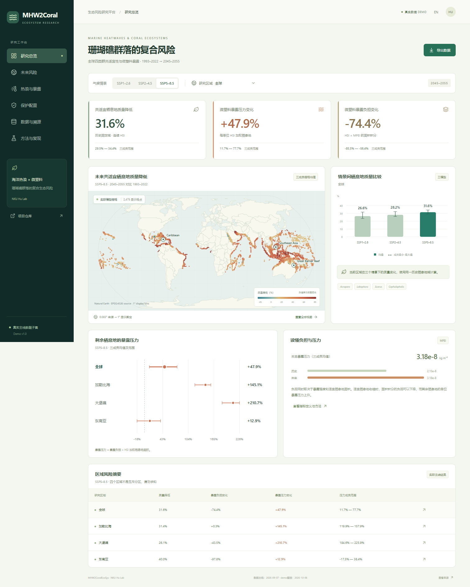

# MHW2CoralEcoSys

A runnable, real-data demonstration of marine heatwaves, four-taxon coral-reef community suitability, modelled microplastic exposure and conservation prioritization. The interface supports Chinese and English. [中文说明](README.zh-CN.md).

**[Open the live demo](https://rugkeypro.github.io/MHW2CoralEcoSys/)** · [Submitted change in the target repository](https://github.com/NKUHuLab/MHW2CoralEcoSys/pull/1) · [Standalone demo ZIP](https://github.com/RugkeyPro/MHW2CoralEcoSys/releases/download/v1.0.0-demo/MHW2CoralEcoSys-demo.zip). The live preview is hosted on the contribution fork while the target pull request awaits merge.



## Run the demo immediately

The repository includes a prebuilt website and all its selected numerical inputs. Python 3.10+ is sufficient; no Node.js, R, database, API key or paid map service is required to view it.

```bash
git clone https://github.com/NKUHuLab/MHW2CoralEcoSys.git
cd MHW2CoralEcoSys
python serve_demo.py
```

Open **http://127.0.0.1:8080**. If reviewing this change before its merge, check out the pull-request branch first. A standalone `MHW2CoralEcoSys-demo.zip` can also be generated using the packaging command below; extract it and run the same server command. A local HTTP server is needed because browsers restrict dataset fetches from `file://` pages.

## Explore

- **Overview:** actual future habitat-quality rasters, modelled burden and pressure changes, and regional summaries.
- **Future risk:** SSP1–2.6 / SSP2–4.5 / SSP5–8.5, four overlapping reporting regions, individual climate members and ensemble ranges.
- **Heatwaves & exposure:** historical low/middle/high MHW groups for *Acropora*, *Lobophora*, *Scarus*, *Cephalopholis* and their community, with the retained bootstrap intervals.
- **Conservation:** repaired September 6 Table S5, priority reallocation, mean selected-area MPEI change and 95% bootstrap intervals.
- **Data & provenance:** download unchanged CSV/GeoTIFF source copies, inspect project-relative lineage and SHA-256.
- **Methods:** definitions, scientific boundaries and reproducibility commands.

All numerical values and map cells come from the selected project outputs. No synthetic observations, random demo metrics, invented time series or simulated model-training progress are used. The basemap is Natural Earth cartography; regional labels are navigation anchors, not analytical boundary polygons.

## Reproduce the numerical example

Following the source/data/code/reproduction pattern of [Lake_Microplastics_Analysis_System](https://github.com/NKUHuLab/Lake_Microplastics_Analysis_System), this repository packages a small runnable calculation with every numerical input it needs:

```bash
python analysis/run_demo.py
python -m unittest discover -s tests
```

The numerical example uses the **Python standard library only**. It checks nine source-file hashes, recomputes member-wise percentage changes, recomputes ensemble means and min–max ranges, verifies pressure = burden / HSI-weighted habitat area, and checks 252 numerical comparisons against accepted tables. Outputs are written to `outputs/demo_results.json` and `outputs/validation.json`. The tests also check agreement with the frozen browser dataset and map-cell coverage.

The inputs contain 12 future ensemble records, 36 future member records, 12 habitat-quality ensemble records, 36 habitat-quality member records, 12 conservation records and 60 historical records. The three source rasters each contain 76,635 valid source cells; 2,479 one-degree display bins preserve all those cells. Map-bin averages are only for visualization and never replace the area-weighted regional result tables.

## Develop and rebuild

Node.js 22.12+ or 24.x and npm are required to change the interface. A lockfile is included.

```bash
npm ci
npm run dev
```

Build, check and package:

```bash
python analysis/run_demo.py --publish
npm test
npm run build
# Linux CI / machines without Edge:
npx playwright install chromium
# Windows uses the installed Microsoft Edge by default:
npm run test:e2e
python scripts/package_demo.py
```

The browser tests exercise real values, scenario/region/language switching, historical and conservation views, source downloads, CSV export and a 390-pixel mobile layout. `scripts/capture_demo.mjs` captures four screenshots against a running preview at port 4173.

To regenerate one-degree map samples from the bundled original rasters:

```bash
pip install -r requirements.txt
python scripts/build_map_subset.py
```

To reimport the subset from the full project, use `python scripts/import_project_subset.py --source-root /path/to/accepted/output/01_mainline`. This reads original inputs, copies selected outputs unchanged and records source hashes. It does not modify the full project. On Windows, keep `node_modules` on a local filesystem; cloud-mounted folders can fail when extracting thousands of dependency files.

## Scientific scope

This is a reproducible **selected-result demonstration**, not the full original modelling workflow or an independent validation of the underlying models.

| View | Accepted lineage | Uncertainty |
| --- | --- | --- |
| Future habitat / exposure | Figure 4 period-matched 36-tracer s1–s4 MPEI, September 2–3 | Mean and minimum–maximum across three climate models |
| Historical MHW groups | Supplementary Fig. S4, static 54-tracer surface MPEI 1993–2019, HSI/MHW 1993–2022 | Retained 2,000 circular four-year moving-block bootstrap draws |
| Conservation | September 6 repaired HSI/MESS + mean 2045–2055 36-tracer MPEI | Full-data point estimate and 95% percentile interval from 1,000 joint climate/model and 5° spatial-block replicates; 991 effective in GBR |

The historical 54-tracer and future 36-tracer lineages are kept separate. The same future MPEI field is used for all SSPs; scenario differences arise from habitat projections. MPEI describes modelled external exposure, not internal dose, coral mortality or measured toxicological effect. Figure 4 exposure panels do not apply strict MESS screening; the conservation analysis uses support tiers based on OR10 and MESS. Global conservation MPEI-change intervals include zero. The four reporting regions overlap and must not be summed.

Full MaxEnt fitting, original NetCDF processing, the complete environmental archive and end-to-end reproduction are outside this subset. The migration inventory previously identified three absent source archives; this demo does not fill those gaps. See [methods and validation](docs/methods_and_validation.md), [data dictionary](docs/data_dictionary.md) and [provenance manifest](data/provenance.json).

## Layout

```text
analysis/run_demo.py       Reproducible numerical example
data/source/              Nine unchanged project-result source files
data/provenance.json       SHA-256, sizes, row counts and source lineage
src/                      React / TypeScript research interface
public/data/              Browser datasets, maps and downloadable source copies
demo/                     Prebuilt website, ready for Python HTTP serving
tests/                    Numerical, frontend and browser checks
docs/                     Methods, data dictionary and captured screenshots
scripts/                  Import, raster aggregation, capture and packaging
.github/workflows/        CI checks and manually triggered Pages deployment
```

## Deployment

The static app runs without external API services. `Dockerfile` / `compose.yaml` provide an optional containerized deployment. For GitHub Pages, a repository administrator can select **Settings → Pages → GitHub Actions**, then run **Deploy research demo to GitHub Pages**. Deployment is manual; this repository does not assume Pages is enabled or claim a live deployment before it succeeds.

## Attribution and reuse

Software is distributed under the [MIT License](LICENSE). Selected project-derived results are included for this reproducible demonstration; underlying third-party datasets retain their original conditions. See [data reuse and attribution](data/README.md). Natural Earth basemap data are public domain, distributed via `world-atlas`; its package attribution is retained in the npm lockfile and documentation. The reference lake repository was used as a delivery standard, not as a source of coral measurements or copied analysis code.
